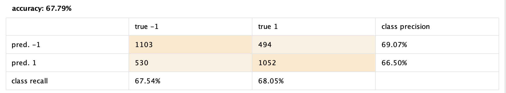
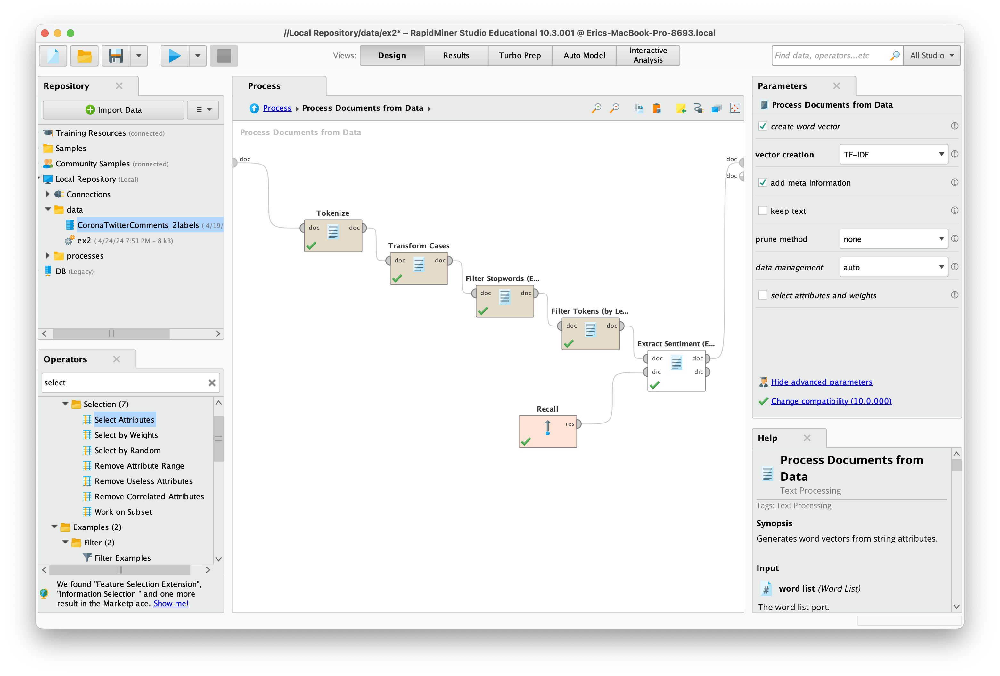
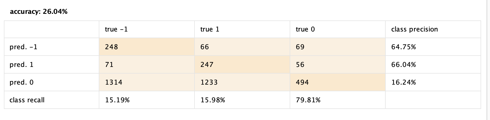

# Labo 3 - Utilisation de RapidMiner

## Exercice 1

1. Est-ce que le changement du paramètre split ratio influence la performance du modèle ? Veuillez expliquer votre réponse.

Voici les performances avec les paramètres de base : (exec time : 55s)

```
PerformanceVector:
accuracy: 90.23%
ConfusionMatrix:
True: 1 0
1: 1446 177
0: 132 1407
precision: 91.42% (positive class: 0)
ConfusionMatrix:
True: 1 0
1: 1446 177
0: 132 1407
recall: 88.83% (positive class: 0)
ConfusionMatrix:
True: 1 0
1: 1446 177
0: 132 1407
AUC (optimistic): 0.991 (positive class: 0)
AUC: 0.866 (positive class: 0)
AUC (pessimistic): 0.816 (positive class: 0)
```

Avec un split ratio de 0.9 : (exec time 48s)

```
ConfusionMatrix:
True: 1 0
1: 482 50
0: 44 478
precision: 91.57% (positive class: 0)
ConfusionMatrix:
True: 1 0
1: 482 50
0: 44 478
recall: 90.53% (positive class: 0)
ConfusionMatrix:
True: 1 0
1: 482 50
0: 44 478
AUC (optimistic): 0.992 (positive class: 0)
AUC: 0.874 (positive class: 0)
AUC (pessimistic): 0.831 (positive class: 0)

```

Avec un split ratio de 0.2 : (exec time 50s)

```
PerformanceVector:
accuracy: 87.26%
ConfusionMatrix:
True: 1 0
1: 3754 619
0: 455 3605
precision: 88.79% (positive class: 0)
ConfusionMatrix:
True: 1 0
1: 3754 619
0: 455 3605
recall: 85.35% (positive class: 0)
ConfusionMatrix:
True: 1 0
1: 3754 619
0: 455 3605
AUC (optimistic): 0.984 (positive class: 0)
AUC: 0.827 (positive class: 0)
AUC (pessimistic): 0.763 (positive class: 0)
```

Nous donc pouvons remarquer une légère baisse de performance du modèle lorsque le paramètre est très bas. Comme il y a moins de données d'entrainement, ici 20% du data set, les performances vont baisser car la modèle est sous-entrainé.

2. Veuillez changer le bloc « Split Validation » avec le bloc « Cross Validation » en utilisant le même classificateur pour l’apprentissage et les mêmes operateurs dans la partie d’évaluation.
Qu’est-ce que vous pouvez constater des résultats correspondants ?

Avec un split ratio a 0.7 :

```
PerformanceVector:
accuracy: 89.60% +/- 1.20% (micro average: 89.60%)
ConfusionMatrix:
True: 1 0
1: 4788 623
0: 473 4657
precision: 90.79% +/- 1.39% (micro average: 90.78%) (positive class: 0)
ConfusionMatrix:
True: 1 0
1: 4788 623
0: 473 4657
recall: 88.20% +/- 1.13% (micro average: 88.20%) (positive class: 0)
ConfusionMatrix:
True: 1 0
1: 4788 623
0: 473 4657
AUC (optimistic): 0.989 +/- 0.003 (micro average: 0.989) (positive class: 0)
AUC: 0.749 +/- 0.173 (micro average: 0.749) (positive class: 0)
AUC (pessimistic): 0.806 +/- 0.019 (micro average: 0.806) (positive class: 0)
```

On a des résultats assez similaires (1% de différence) mais le runtime est un peu plus long (1min05)

3. Dans le bloc « Process Documents from Data » nous n’avons pas mis d’étape de stemming.
Est-ce que l’ajout de ce prétraitement a un impact sur les résultats obtenus ?

Avec le block Stem (Porter) :

```
PerformanceVector:
accuracy: 87.54%
ConfusionMatrix:
True: 1 0
1: 1429 245
0: 149 1339
precision: 89.99% (positive class: 0)
ConfusionMatrix:
True: 1 0
1: 1429 245
0: 149 1339
recall: 84.53% (positive class: 0)
ConfusionMatrix:
True: 1 0
1: 1429 245
0: 149 1339
AUC (optimistic): 0.985 (positive class: 0)
AUC: 0.840 (positive class: 0)
AUC (pessimistic): 0.774 (positive class: 0)`

```

Nous avons également essayé le stem Snowball et les résultats étaient similaires.

Les performances ne changent pas enormement mais nous avons un gain important en terme de temps d'execution (35 secondes contre 55 sans stemming). Ceci est explicable par le fait que l'étape de validation, la plus longue, reçoit moins de données donc c'est moins long.

4. Jusqu’à présent nous avons utilisé un classificateur bayésien. Veuillez essayer d’autres familles de classificateurs, quel est l’impact sur le résultat obtenu ?

Avec la régression logistique SVM :
Temps d'execution beaucoup plus long 1m38 mais performances très élevées :

```
PerformanceVector:
accuracy: 89.37%
ConfusionMatrix:
True: 1 0
1: 1523 281
0: 55 1303
precision: 95.95% (positive class: 0)
ConfusionMatrix:
True: 1 0
1: 1523 281
0: 55 1303
recall: 82.26% (positive class: 0)
ConfusionMatrix:
True: 1 0
1: 1523 281
0: 55 1303
AUC (optimistic): 0.973 (positive class: 0)
AUC: 0.973 (positive class: 0)
AUC (pessimistic): 0.973 (positive class: 0)
```

## Exercice 2

1. Résultats obtenus par rapport aux étiquettes existantes sur le dataset.



Avec cette architecture, nous obtenons  une accuracy de 67.79%.
Le modèle a plus tendancee de donner un sentiment négativ, ce qui est correct 69% du temps.
Pour le sentiment positif, on a une précision de 66%, un peu moins que pour le sentiment négatif.

L'accuracy est assez basse. L'équilibre entre precisions et recall est relativement bon, ce qui signifie que le modèle n'est pas biaisé à prédire un sentiment plutôt qu'un autre.

2. Quelle est l’influence des différentes étapes de « text processing » sur le résultat que vous obtenez ?

- Tokenize: Sépare le texte en mots individuels.
- Transform Cases: normalise la casse, assurant que tous les mots sont en minuscules.
- Filter Stopwords: supprime les mots communs qui n'apportent pas de sens au sentiment (e.g. the, as, to, ...), réduisant le bruit.
- Filter Tokens (by Length): élimine les mots trop courts ou trop longs, qui ne sont pas pertinents pour l'analyse de sentiment.
- Extract Sentiment: applique l'analyse de sentiment pour extraire le ton du texte.

Chacune de ses étape rafine les données textuelles, assurant que l'analyse de sentiment est aussi précise et significative que possible.



3. Deuxième étape

Le calcul du threshold a été changé de la manière suivante :

```
if([sentiment] > 0.2, 1, if([sentiment] < -0.2, -1, 0))
```

Nous obtenons alors les résultats suivants :



Cette fois, nous avons 3 classes de sentiments : positif (1), neutre (0) et négatif (-1).
Nous obtenons une accuracy très basse, de 26.04% (le modèle est correct environ 1 fois sur 4).
Nous obtenons un haut recall, mais une faible précision. Ceci signifie que le modèle a tendance à prédire plus de classes neutres que de classes positives ou négatives.

Pour obtenir de meilleurs résultats, il serait intéressant de fine-tuner le threshold pour obtenir un meilleur équilibre entre précision et recall.


## Exercice 3

1. Le ratio de samples attribués au training set et test set influe sur les performances du modèle, en effet les résultats changent lorsque qu'on joue avec le ratio. On constate un probable sur-apprentissage avec un ratio 0.9 - 0.1.

- Ratio 0.6 - 0.4:


- Ratio 0.7 - 0.3:


- Ratio 0.9 - 0.1:


2. On fait varier le paramètre k avec un ratio 0.7 - 0.3 fixe.
Les résultats varient en fonction de la valeur de k, la plus grosse variation visible est cependant visible dans la précision lorsque l'on choisit le k-nn pondéré.

- k = 20:


- k = 80 (default value):


- k = 80 pondéré (weighted knn)


- k = 160:


3. On constate qu'en utilisant l'élément **User k-nn**, toutes les métriques de performance augmentent.


4. La combinaison des modèles **User k-nn** et **Item k-nn** fait baisser légèrement l'area under the curve mais permet une augmentation de la précision.


5. Fine tuner les paramètres/modèles utilisés permet d'augmenter les performances générales de prédiction. 

6. Les meilleures possibilités testées sont le modèle **Item k-nn pondéré** (weighted) et la combinaison testée au point 4 où la précision, l'area under the curve et la mean average precision sont au plus haut.

7. On constate qu'en utilisant l'élément **User k-nn**, toutes les métriques de performance augmentent.

